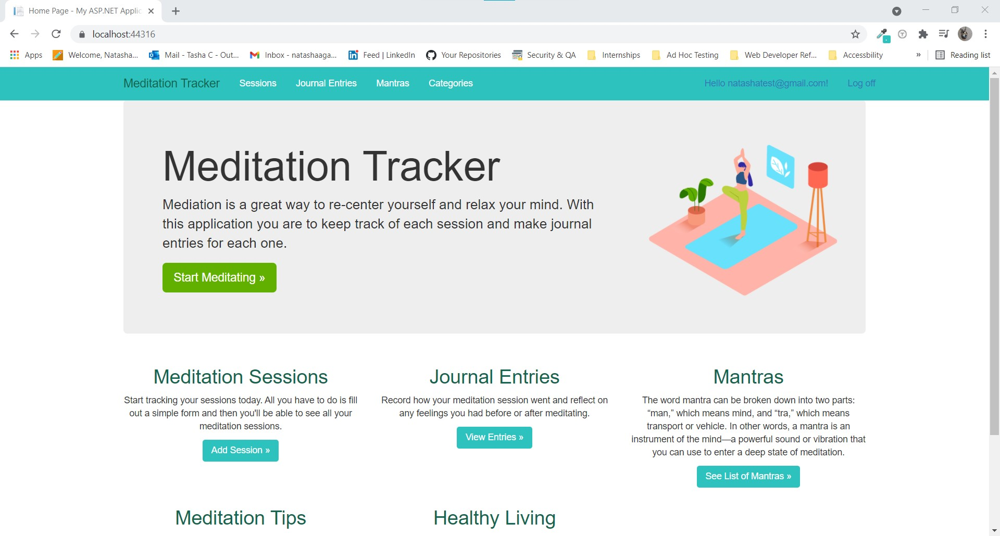
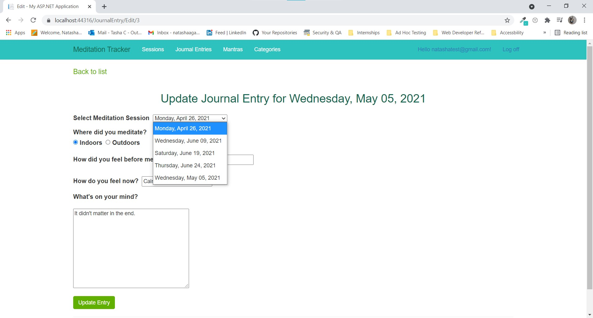
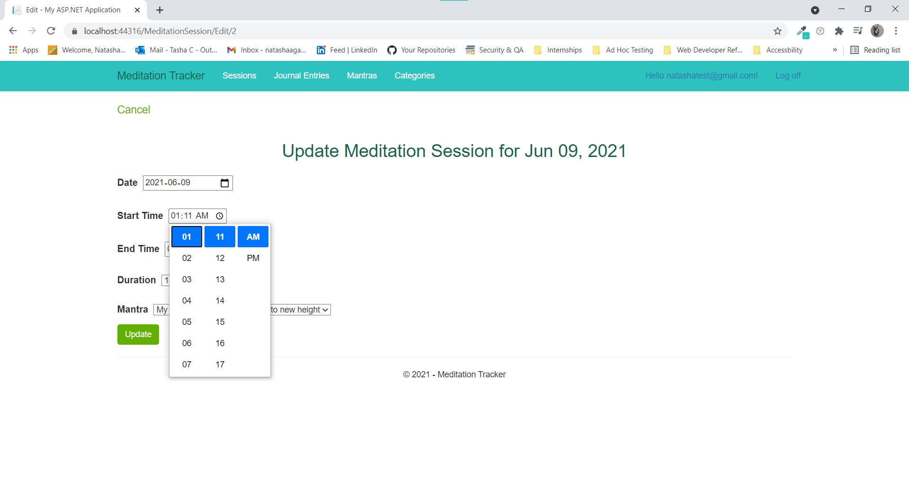
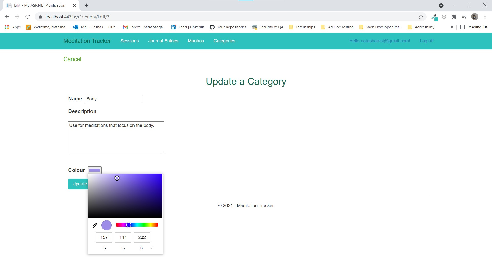
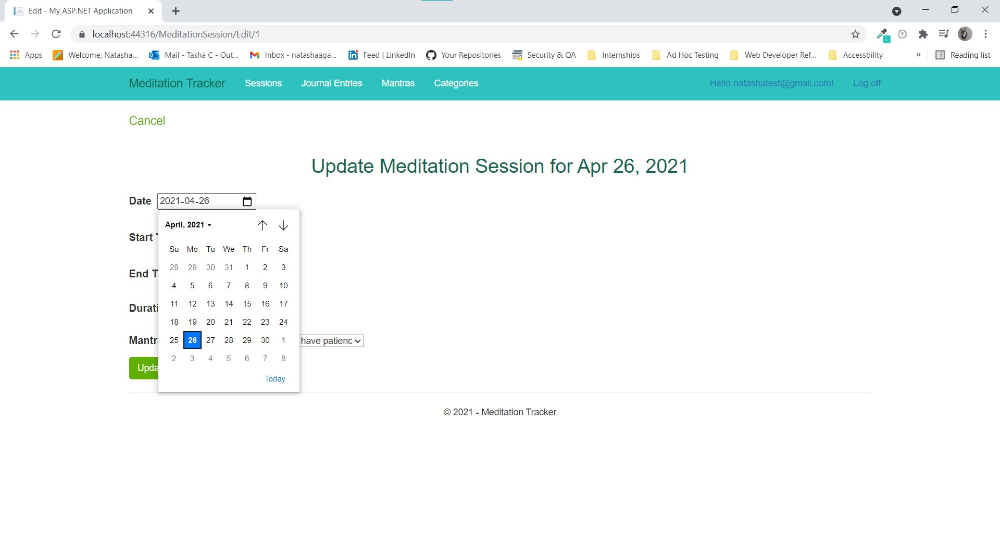

# Meditation Tracker
This application was created for the Passion Project for the class HTTP5204 - Mobile Development. 
I used Code-First Migrations to create my database, ASP.NET MVC Framework and LINQ to perform 
CRUD operations.

## Description
For my passion project I created an application where users have the ability to track meditation sessions, 
add journal entries for those sessions, and search for mantras to use during their sessions.

## Entity Model Relationships
- 1-1 Between Meditation Sessions and Journal Entries
- 1-M Between Mantras and Meditation Sessions
- M-M Between Categories and Mantras

## Features
- [X] Add, Edit and Delete Sessions, Entries, Mantras and Categories as a Registered User
- [X] View a List of Sessions and Journal Entries as a Registered User
- [X] View a List of Mantras and Categories as non-registered User
- [X] Searchbar for Mantras
- [X] Assign and UnAssign Mantras to Categories as a Registered User
- [X] Register and Sign Up

## To Run Project
- Make sure there is an App_Data folder in the project (Right click solution > View in File Explorer)
- Tools > Nuget Package Manager > Package Manage Console > Update-Database
- Check that the database is created using (View > SQL Server Object Explorer > MSSQLLocalDb > ..)

## Images
### Home Page

### Session Selector

### Time Selector

### Colour Selector

### Date Selector

## Extra Features/Updates
- [ ] Add filter that sorts Mantras based on categories
- [X] Arrange Meditation Sessions and Journal Entries by Date (Descending Order)
- [ ] Have images related to categories
- [ ] Create timer for Meditation Session
- [ ] Add Timer and audio/music
- [X] TinyMCE Editor https://www.tiny.cloud/
- [X] Validation to forms

### Bugs 
- [ ] Fix issue with wrong start time and end time being logged into database
